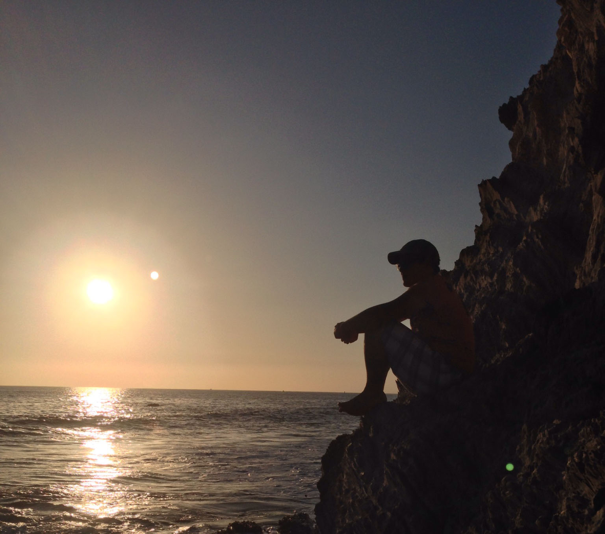

* Love tinkering with home automation  

* Food/IPAs/Whiskey are the key to my heart  

* Married to the wonderful, supportive, intelligent Medina Ponjevic Davis 

* Have a smart/creative/talented daughter named Kayley  

* Cat lover, currently only have one named Ovechkitten  

* I'll be a Junior Developer for life. 

* I rarely know what I'm doing but I love figuring things out. I'm not afraid to admit I don't know answers, but I never back away from challenges. 

* I obsessively plan things out. I plan things way beyond anything feasible, but I love thinking forward. I love thinking about possibilities. 

* I have ADHD and alternate between being obsessed and struggling to focus. *medication and a good therapist definitely help with this*

* I am very passionate about helping people in any form. I love teaching people, I love propping others up. I feel much better about myself when I know others are in a better place because of something I've done. 

* I go into rabbit holes when I want to learn something new. I spend a lot of time reading through docs and reading people's Q&As on topics before diving in. It gives me more confidence when I want to start using something. 

* My wife is from Sweden and her parents were refugees from Bosnia. I've learned a lot about different cultures through them.

* I am extremely grateful for the things I've been given in this life and I know I'm very privileged and I intend to do everything I can to use that to help as many people as I am capable of doing. 

 

